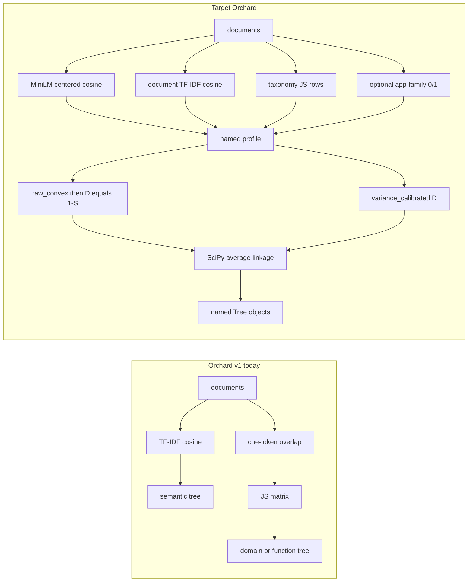

# Restore AppWorld-style layered similarity + fusion in Orchard

Status: **plan for review**. Execute one phase at a time after approval. Do not start Phase N+1 until Phase N acceptance criteria pass. Do not modify `tool-tree-demo/`, `doc-enrichment/`, `graph-engine/`, or `text_analyzer/`.

**Policy:** port AppWorld numerics (D-002, D-027, D-029, D-030, D-031). Do not redesign formulas, silently renormalize weights, concatenate heterogeneous feature vectors, or treat TF-IDF as the primary semantic driver.

**Phases**

1. Fusion engine + layer registry (no neural models)
2. MiniLM semantic backend + semantic-tree default
3. ModernBERT taxonomy classification
4. Wire fused taxonomy trees + exposed config
5. Hardening, fallbacks, docs

---

## Current vs target



Public branching **does not change**:

- `OrchardBuilder().build(docs)` → `domain` + `function` trees
- `OrchardBuilder(taxonomies=[]).build(docs)` → `semantic` tree
- `include_semantic_with_taxonomies=True` still adds `semantic`

What changes is **how each named tree’s matrix is made**: independent layers → inspectable profile → fusion → dissimilarity → average linkage. There is still **no** single orchard tree named `fused` / `mixed`.

---

## Mapping decisions (resolved — do not re-guess)

### 1. Cross-taxonomy JS: include both layers

**Decision:** when both default taxonomies are present, **each** tree includes **both** `domain_raw_js` and `function_raw_js` (true AppWorld fusion).

**Rationale:** no contract conflict. Extraction’s “no fused default tree” meant “no one mixed Domain+Function+semantic orchard tree,” not “each named tree may use only one layer.” Architecture construction already lists embeddings → independent matrices → fused profiles → linkage. Tree **names** stay `domain` / `function` / `semantic`.

If only one taxonomy is configured, the missing JS layer is **absent**. Do not silently renormalize. Use the single-taxonomy dicts below.

Orchard layer name is `function_raw_js` (tree id `function`). That is the AppWorld `functional_raw_js` layer.

### 2. No-app weights: fold 0.03 into the dominant taxonomy JS

Orchard documents usually have no `app_name`. Default profiles **omit** `app_exact_match` and use these exact dicts (already sum to 1):

**`semantic` (always, no taxonomy/app):**

- `description_minilm_centered_cosine`: `0.66`
- `tfidf_cosine`: `0.34`

**`domain` (both taxonomies present, no app):**

- `domain_raw_js`: `0.48`
- `description_minilm_centered_cosine`: `0.23`
- `tfidf_cosine`: `0.14`
- `function_raw_js`: `0.15`

**`function` (both taxonomies present, no app):**

- `function_raw_js`: `0.48`
- `description_minilm_centered_cosine`: `0.25`
- `tfidf_cosine`: `0.15`
- `domain_raw_js`: `0.12`

**Rationale:** AppWorld kept 3% exact-app as a transparent starting point, not an optimized target. Folding that 3% into the dominant JS preserves the intended dominance without silent renormalization.

**With-app dicts** (Phase 5 only, when every document has a family key) are the AppWorld G3 numbers with `keyword_tfidf_cosine` renamed to `tfidf_cosine`:

- domain: app `0.03`, minilm `0.23`, domain_js `0.45`, function_js `0.15`, tfidf `0.14`
- function: app `0.03`, minilm `0.25`, domain_js `0.12`, function_js `0.45`, tfidf `0.15`

**Single-taxonomy, no app** (explicit; fold the missing JS into the present dominant JS):

- only domain: `domain_raw_js=0.63`, minilm `0.23`, tfidf `0.14`
- only function: `function_raw_js=0.60`, minilm `0.25`, tfidf `0.15`

### 3. Keyword vs document TF-IDF

**Decision:** Orchard default lexical layer is **document-text TF-IDF**, layer name `tfidf_cosine`, implemented by existing [../src/orchard/backends/tfidf.py](../src/orchard/backends/tfidf.py). Swappable. **Do not** revive `doc-enrichment` LLM keyword calls in this work.

### 4. Taxonomy pairwise default

`taxonomy_similarity` stays `"jensen_shannon"` (`1 - JSD/ln(2)`). Cosine over probability rows remains an available layer variant, not the taxonomy-tree default.

### 5. Fusion mode default

`fusion_mode: "variance_calibrated" | "raw_convex"`. Default **`variance_calibrated`**. Ward is rejected on this precomputed-dissimilarity path.

### 6. Missing extras vs offline fallback

**Decision:** neural backends are the **intended** defaults. If a neural backend is selected and its extra is missing, **fail loudly** (`MissingOptionalDependencyError`) with the extra name and the exact opt-in. Do **not** silently swap MiniLM for TF-IDF and still call the tree neural.

Explicit opt-ins that keep the clean-env / README / CI path working:

- `allow_offline_fallback=True` → today’s single-layer trees (`tfidf_cosine=1.0` for semantic; own-taxonomy JS `1.0` for each taxonomy tree). Provenance must say `offline_fallback`, not MiniLM/ModernBERT.
- or pass `embedding_backend=TfidfEmbeddingBackend()` / cue-only taxonomies / a custom `SimilarityProfile`

Phase 1 does **not** change current defaults (still TF-IDF / cue, no extra required). Phases 2–4 flip intended defaults and update tests/README to use the explicit opt-in for no-extra CI.

### 7. Packaged Domain/Function heads (shipped pretrained defaults)

**Decision:** ship the already-trained AppWorld Phase 2B Domain and Function ModernBERT+logistic **student heads** as Orchard-owned default assets. When `orchard[taxonomy-ml]` is installed, default `DomainTaxonomy` / `FunctionTaxonomy` **load those packaged heads**. `transform()` is `modernbert_logistic`. Cue is not used.

**If the extra is missing:** loud `MissingOptionalDependencyError` unless `allow_offline_fallback=True` (or an explicit cue-only / custom taxonomy). Fallback uses cue and records `taxonomy_transform: "cue"`.

`fit` / `load_head` / `save_head` remain for **replacing** heads. They are not the only way to get ModernBERT.

**Do not git-add the raw joblib as the public asset.** Do not vendor `registry.json` or its absolute Windows `model_file` paths. One-time export from the local gitignored students into portable arrays:

| Source (read-only, this machine) | SHA-256 | Classes |
|---|---|---|
| `tool-tree-demo/artifacts/appworld/phase2b/classification/runtime/models/domain_taxonomy_v0_student.joblib` | `b927c99282099f322396b5671e58d2796d2f6c23ff8e1241f2bd6fe609b4021b` | 11 `domain.*`, 768-d |
| `tool-tree-demo/artifacts/appworld/phase2b/classification/runtime/models/functional_taxonomy_v0_student.joblib` | `13fa57af1f0e18d568c36091a465499baa6f6e661dce877fad714c4b741d0114` | 9 `func.*`, 768-d |

Verified on this machine: files exist, SHAs match, payloads are weight dicts `{weights, intercept, classes}` (not a full sklearn pickle). Label **sets** match Orchard `domain.json` / `function.json`. Label **order** does **not**: students are sklearn-alphabetical; Orchard `label_order` is definition order. Export/load must remap `predict_proba` columns onto packaged `label_order` (same set). After export, runtime must not depend on `artifacts/appworld/`.

**Packaged format** under [../src/orchard/assets/taxonomies/heads/](../src/orchard/assets/taxonomies/heads/):

- `domain.npz` / `function.npz`: `coef_`, `intercept_`, `classes_` (document stored order vs remapped order)
- sidecar JSON: schema version, taxonomy name + version, `classes_` order, ModernBERT id + revision `8949b909ec900327062f0ebf497f51aef5e6f0c8`, pooling, `max_length=512`, logistic hyperparameters (`C=0.1`, `class_weight=balanced`, `max_iter=1000`), seed `20260725`, source student SHA-256s above, taxonomy definition checksum, export date, sklearn version used at export
- Rebuild the sklearn estimator at load time from arrays. Verify loaded class set == packaged `label_order`.

**Provenance (required in `heads/PROVENANCE.md`):** these are AppWorld Phase 2B student heads trained on tool text (API name + description + parameter docs + normalized keywords). They are an **AppWorld-tool prior**. They will run on any document; they are **not** a universal document classifier.

**Do not:** import `doc-enrichment` / `transformer_cat`; use ModernBERT as the description embedding; silently fall back to cues while claiming neural taxonomy; copy AppWorld classification caches, tool IDs, or deterministic overrides.

---

## API sketch (one builder — do not invent a second)

```python
# orchard/src/orchard/backends/fusion.py
@dataclass(frozen=True)
class SimilarityProfile:
    name: str
    weights: Mapping[str, float]          # finite, >=0, sum == 1.0 exactly (abs_tol=1e-12)
    fusion_mode: Literal["variance_calibrated", "raw_convex"] = "variance_calibrated"

# layer protocol
class SimilarityLayer(Protocol):
    name: str
    def matrix(self, documents: Sequence[Document], **ctx) -> np.ndarray: ...
    # -> [n,n] finite, symmetric, [0,1], unit diagonal

# orchard/src/orchard/builder.py  (same class, new fields)
@dataclass
class OrchardBuilder:
    taxonomies: Any = _UNSET
    embedding_backend: Any | None = None          # MiniLM default when extra present
    lexical_backend: Any | None = None            # TfidfEmbeddingBackend
    taxonomy_classifier_backend: Any | None = None
    fusion_mode: Literal["variance_calibrated", "raw_convex"] = "variance_calibrated"
    profiles: Mapping[str, SimilarityProfile] | None = None   # keyed by tree id
    semantic_weights: Mapping[str, float] | None = None
    taxonomy_weights: Mapping[str, Mapping[str, float]] | None = None
    linkage_method: str = "average"               # reject "ward" on this path
    semantic_signed_cosine: bool = False          # TF-IDF layer only
    taxonomy_similarity: str = "jensen_shannon"
    include_semantic_with_taxonomies: bool = False
    allow_offline_fallback: bool = False
    description_transform: str = "centered"       # centered|raw|whitened|centered_pc3
    family_metadata_key: str | None = None        # Phase 5; default None
    metadata: dict[str, Any] = field(default_factory=dict)

    def get_params(self) -> dict[str, Any]: ...
    def build(self, documents) -> Orchard: ...
```

`get_params()` / orchard metadata must record: fusion mode, per-tree weights, active layer names, backend class names, model id + revision + pooling + transform, taxonomy transform kind, `allow_offline_fallback`, checksums when available.

**Extras** ([../pyproject.toml](../pyproject.toml)):

- `orchard[embeddings]` — `torch`, `transformers` (MiniLM via `AutoModel` / `AutoTokenizer`)
- `orchard[taxonomy-ml]` — `torch`, `transformers` (ModernBERT features; sklearn already core)
- `orchard[ml]` — both
- **Do not** add the `sentence-transformers` package. AppWorld MiniLM used Hugging Face id `sentence-transformers/all-MiniLM-L6-v2` loaded with `transformers` only.

Core install stays `numpy` / `scipy` / `scikit-learn` only.

Public verb remains `build`. `Tree.from_linkage` stays valid. Labels never mutate linkage.

---

## File-level map

### Port numerics from `tool-tree-demo` (copy formulas, new Orchard modules, no import of `tool_tree_demo`)

| Source | Extract | Destination |
|---|---|---|
| [phase3.py](../../tool-tree-demo/src/tool_tree_demo/phase3.py) `fuse`, weight validation | convex sum + abort on invalid/non-unit-sum weights | [../src/orchard/backends/fusion.py](../src/orchard/backends/fusion.py) |
| [phase3b.py](../../tool-tree-demo/src/tool_tree_demo/phase3b.py) `raw_convex_fusion`, `variance_calibrated_fusion`, `validate_dissimilarity` | exact formulas + `variance_floor=1e-12` | same |
| [phase3b.py](../../tool-tree-demo/src/tool_tree_demo/phase3b.py) `build_description_variants`, `_raw_cosine`, `_mapped_cosine`, `TRANSFORM_CONFIG` | centering / whitening / PC-3 (default = centered) | [../src/orchard/backends/minilm.py](../src/orchard/backends/minilm.py) |
| [phase4a.py](../../tool-tree-demo/src/tool_tree_demo/phase4a.py) `_dissimilarity` | raw-convex `D=1-S`; calibrated D consumed as-is | [../src/orchard/backends/similarity.py](../src/orchard/backends/similarity.py) `linkage_from_dissimilarity` |
| [sentence_embedding_bridge.py](../../tool-tree-demo/adapters/sentence_embedding_bridge.py) | in-process encode: MiniLM revision, seed `20260725`, batch 32, max_length 256, attention-mask mean pool, cache key = model+revision+text sha256+config | [../src/orchard/backends/minilm.py](../src/orchard/backends/minilm.py) |
| [transformer_classifier_bridge.py](../../tool-tree-demo/adapters/transformer_classifier_bridge.py) | ModernBERT features + `LogisticRegression(C=0.1, class_weight="balanced", max_iter=1000, random_state=20260725)`, full `predict_proba` over `label_order` | [../src/orchard/backends/modernbert.py](../src/orchard/backends/modernbert.py) + [../src/orchard/taxonomy.py](../src/orchard/taxonomy.py) |
| [phase3b_reduced_profiles.v1.json](../../tool-tree-demo/config/phase3b_reduced_profiles.v1.json) | weight numbers, adapted as above | [../src/orchard/assets/profiles/](../src/orchard/assets/profiles/) |

Already in Orchard (reuse, do not fork): `cosine_matrix`, `jensen_shannon_matrix`, `finalize_similarity`, `validate_similarity_matrix`, `similarity_to_dissimilarity`, `TfidfEmbeddingBackend`, `TaxonomyModel._cue_transform`, `Tree.from_linkage`.

### Write new (Orchard-owned)

- [../src/orchard/backends/layers.py](../src/orchard/backends/layers.py) — layer protocol + registry
- [../src/orchard/backends/fusion.py](../src/orchard/backends/fusion.py) — `SimilarityProfile`, both fusion modes
- [../src/orchard/backends/minilm.py](../src/orchard/backends/minilm.py) — Phase 2
- [../src/orchard/backends/modernbert.py](../src/orchard/backends/modernbert.py) — Phase 3 encoder + rebuild LogisticRegression from arrays
- [../src/orchard/backends/taxonomy_heads.py](../src/orchard/backends/taxonomy_heads.py) — export/load helpers for packaged heads (Phase 3)
- [../src/orchard/assets/taxonomies/heads/](../src/orchard/assets/taxonomies/heads/) — `domain.npz` / `function.npz`, sidecars, `PROVENANCE.md` (Phase 3)
- one-time export script (e.g. `scripts/export_taxonomy_heads.py`) that reads the local joblibs above and writes the portable payload; not a runtime dependency
- [../src/orchard/backends/family.py](../src/orchard/backends/family.py) — Phase 5
- [../src/orchard/assets/profiles/](../src/orchard/assets/profiles/) — JSON weight dicts + provenance
- `MissingOptionalDependencyError`, `InvalidFusionError` in [../src/orchard/exceptions.py](../src/orchard/exceptions.py)

### Do not port

AppWorld 457-tool checks; G3 packets / neighbor diagnostics; LLM keywords; AppWorld deterministic overrides; subprocess JSON bridges as public API; ModernBERT as **description** default ([phase3_embedding_bridge.py](../../tool-tree-demo/adapters/phase3_embedding_bridge.py)); retrieval / BigTool / Postgres; contrastive labeling.

**Provenance comment** on each extracted numeric function: source file, function name, decision ids (D-027/D-029/D-030/D-031).

### Source-review pins (from AppWorld code — do not “improve”)

These came from a second pass over `phase3.py` / `phase3b.py` / `phase4a.py` and the three bridges. A coding agent must honor them.

- **Fusion implementation to copy is Phase 3B, not Phase 3 `fuse`.** `raw_convex_fusion` symmetrizes, sets diag=1, clips `[0,1]`. Phase 3 `fuse` calls `_finalize_matrix` after the same weighted sum. Use the Phase 3B functions as the product cores; keep Phase 3 `load_profiles` weight-abort rules (`abs_tol=1e-12`, never renormalize).
- **`_calibrated_as_similarity` is diagnostics only.** Do not feed `1 - D/max(D)` into linkage. Calibrated profiles consume `D` as-is (`phase4a._dissimilarity`).
- **Whitening covariance is sample covariance** `centered.T @ centered / (n - 1)`, then `eigh`, eigenvalues sorted descending. Floor `1e-6 * λ_max`, ridge `1e-4 * λ_max`, drop 3 PCs for the diagnostic variant only.
- **MiniLM encode:** `transformers.AutoModel` + `AutoTokenizer`, attention-mask mean pool, `max_length=256`, batch 32, 384-d, seed `20260725`, offline `local_files_only` when a snapshot is present. Centering/whitening happen **after** encode in numpy, never inside the encoder.
- **ModernBERT encode (taxonomy features only):** 768-d, mean pool, prototype `max_length=512`, batch 16. Do **not** import `doc-enrichment` / `transformer_cat`. Do **not** use ModernBERT as the default description layer.
- **Cache keys must include HF revision.** The Phase 3 ModernBERT bridge omitted revision from its cache spec; Orchard must include `model` + `revision` + text checksums + config (MiniLM bridge already does this).
- **No subprocess JSON bridges and no separate classifier venv.** Those existed because AppWorld’s Pydantic 1 runtime could not share an env with the prototype. Orchard is a library: in-process lazy imports.
- **Ship portable head arrays, not raw joblibs or the prototype registry.** Phase 3 exports `{weights, intercept, classes}` from the verified local students into `assets/taxonomies/heads/`. Do not vendor absolute `model_file` paths. Remap alphabetical `classes_` onto Orchard `label_order`.

---

## Phase 1 — Fusion engine + layer registry (no neural models)

**Goal.** Independent layers can be fused with AppWorld math. Existing cue/TF-IDF trees keep current outputs.

**In scope**

- [../src/orchard/backends/fusion.py](../src/orchard/backends/fusion.py)
- [../src/orchard/backends/layers.py](../src/orchard/backends/layers.py)
- [../src/orchard/backends/similarity.py](../src/orchard/backends/similarity.py) — add `linkage_from_dissimilarity`; reject `ward` on this path
- [../src/orchard/builder.py](../src/orchard/builder.py) — add `fusion_mode`, `profiles` / weight fields; **default profiles are single-layer** so current trees are unchanged
- [../src/orchard/exceptions.py](../src/orchard/exceptions.py)
- [../src/orchard/backends/__init__.py](../src/orchard/backends/__init__.py)
- [../CODE_MANIFEST.md](../CODE_MANIFEST.md) — mark new modules shipped; MiniLM/ModernBERT stay `[proposed]`
- tests: `../tests/test_fusion.py` (new)

**Numeric cores to port exactly**

```text
raw_convex: S = Σ wᵢ Sᵢ; finalize (symmetrize, clip [0,1], diag=1); D = 1 − S; diag(D)=0
variance_calibrated:
  for each layer: mean/std of upper-triangle off-diagonals
  z = (S − mean) / std
  abort if any layer variance ≤ 1e-12
  fused_z = Σ wᵢ zᵢ
  abort if var(fused_z upper) ≤ 1e-12
  D = max(offdiag fused_z) − fused_z; symmetrize; max(D,0); diag=0
weights: finite, ≥0, sum exactly 1 (abs_tol=1e-12); never silently renormalize
```

**Tests (CI, no GPU, no downloads)**

- toy 2×2 raw-convex: `S1` off-diag 0.8, `S2` off-diag 0.2, weights 0.75/0.25 → fused off-diag 0.65, `D` 0.35
- toy ≥3×3 variance-calibrated against a hand-computed fixture
- abort when a selected layer’s off-diagonal variance ≤ `1e-12`
- abort when weights do not sum to 1, are negative, or name unknown layers
- existing `../tests/test_builder_semantic.py` and `../tests/test_builder_taxonomies.py` still pass **unchanged** (single-layer defaults)
- `pyproject.toml` core deps unchanged; no `torch` import in Phase 1 modules

**Acceptance**

- TF-IDF-only and JS-only layers fuse with exposed weights
- `SimilarityProfile` is inspectable
- default `OrchardBuilder().build` / `taxonomies=[]` behavior identical to today
- no torch dependency

**Out of scope / do not do in Phase 1**

- no torch, transformers, MiniLM, ModernBERT
- no classifier work, no taxonomy-head changes
- no docs-site rewrite, no README rewrite, no RELEASE_GATE rewrite
- no `orchard/docs/DECISIONS.md` yet (Phase 4)
- no app-family layer
- no default-weight flip to 0.66/0.34 or domain/function fused profiles
- do not delete cue transform or `TfidfEmbeddingBackend`

**Rollback.** Revert the new backend modules and builder field additions; default path unused = existing trees unchanged.

---

## Phase 2 — MiniLM semantic backend + semantic-tree default

**Goal.** Semantic tree default is MiniLM-centered cosine fused with document TF-IDF (0.66 / 0.34), variance-calibrated.

**In scope**

- [../src/orchard/backends/minilm.py](../src/orchard/backends/minilm.py)
- [../pyproject.toml](../pyproject.toml) — `embeddings` extra
- [../src/orchard/builder.py](../src/orchard/builder.py) — resolve default embedding backend; semantic profile
- [../src/orchard/assets/profiles/semantic.json](../src/orchard/assets/profiles/semantic.json)
- tests: `../tests/test_minilm_transforms.py` (centering/mapping on injected vectors, no model); `../tests/test_builder_semantic.py` updated; optional `@pytest.mark.optional_model` live encode

**MiniLM contract (D-029 / Phase 3B — do not change)**

- Hugging Face id `sentence-transformers/all-MiniLM-L6-v2` loaded with **`transformers` only** (no `sentence-transformers` extra)
- revision `c9745ed1d9f207416be6d2e6f8de32d1f16199bf`
- 384-d, attention-mask mean pool, batch 32, max_length 256, seed `20260725`
- local / revision-pinned; no network if snapshot present; no OpenAI embeddings
- default transform: corpus-center, then signed cosine `(S+1)/2` (measure raw cosine first, then map)
- raw / whitened / centered-minus-3PC implemented as `description_transform` variants, **not** defaults (`TRANSFORM_CONFIG`: eigenvalue floor `1e-6` of max, ridge `1e-4` of max, remove 3 PCs; cov `/(n-1)`)
- lazy-import torch; missing extra → `MissingOptionalDependencyError` unless `allow_offline_fallback` or explicit `TfidfEmbeddingBackend`

**Tests**

- fake/injected encode backend: semantic build uses 0.66/0.34 + `variance_calibrated`; `get_params()` records model, revision, transform, weights, fusion mode
- CI centering + `(S+1)/2` on a tiny synthetic embedding matrix (no download)
- explicit `TfidfEmbeddingBackend()` still builds a TF-IDF-only semantic tree
- missing extra + default backend raises; `allow_offline_fallback=True` builds TF-IDF and records fallback
- live MiniLM test marked optional

**Acceptance.** `OrchardBuilder(taxonomies=[]).build(...)` with embeddings extra (or injected MiniLM) uses MiniLM-dominated fusion. CI passes with a fake backend. TF-IDF-only is explicit opt-in.

**Out of scope.** Taxonomy fusion weights; ModernBERT; docs-site rewrite (short builder docstring update OK).

**Rollback.** Default `embedding_backend` back to TF-IDF; keep MiniLM module unused.

---

## Phase 3 — ModernBERT taxonomy classification + shipped default heads

**Goal.** When `orchard[taxonomy-ml]` is installed, default Domain/Function taxonomies load the **packaged pretrained heads** and `transform()` is `modernbert_logistic`. Cue is the explicit offline fallback, not the neural default.

A later coding agent **must not skip the export**. Phase 1–2 stay unchanged (no ModernBERT there).

**In scope**

- one-time export script or documented export steps: read the verified local joblibs → write portable `npz` + sidecar JSON under [../src/orchard/assets/taxonomies/heads/](../src/orchard/assets/taxonomies/heads/)
- [../src/orchard/backends/taxonomy_heads.py](../src/orchard/backends/taxonomy_heads.py) — load arrays, remap to `label_order`, rebuild `LogisticRegression`
- [../src/orchard/backends/modernbert.py](../src/orchard/backends/modernbert.py) — Orchard-owned mean-pool encoder (do **not** import `doc-enrichment` / `transformer_cat`)
- [../src/orchard/taxonomy.py](../src/orchard/taxonomy.py) — default-load packaged heads when extra present; `fit` / `load_head` / `save_head` for replacements; cue only on explicit fallback
- [../src/orchard/assets/taxonomies/PROVENANCE.md](../src/orchard/assets/taxonomies/PROVENANCE.md) and `heads/PROVENANCE.md` — AppWorld-tool prior, SHAs, domain-shift caveat
- [../pyproject.toml](../pyproject.toml) — `taxonomy-ml` + `ml` extras
- tests: `../tests/test_taxonomy_modernbert.py` — packaged-array load + **injected fake encoder**; optional live ModernBERT

**Classifier contract (D-024 / Phase 2B)**

- features: `answerdotai/ModernBERT-base` @ `8949b909ec900327062f0ebf497f51aef5e6f0c8`, 768-d, attention-mask mean pool, `max_length=512`, batch 16
- default heads: exported student weights above (11 domain / 9 function classes)
- text at **train** time was AppWorld tool text (API name + description + parameter docs + normalized keywords). Orchard `transform` uses `title` + `text` (no `app_name`, no LLM keywords). Record this domain shift in provenance; do not invent a new training corpus in this phase.
- head hyperparameters: `LogisticRegression(C=0.1, class_weight="balanced", max_iter=1000, random_state=20260725)`
- output: full probability rows over Orchard `label_order`, remapped from student `classes_` if needed; **not** argmax-only
- JS matrices consume those rows unchanged
- ModernBERT is **not** the default description embedding

**Tests**

- load packaged `domain.npz` / `function.npz`: class set == `label_order`, `coef_` shape `(n_labels, 768)`, sidecar SHA matches the source students
- fake encoder + packaged (or tiny fixture) head → `transform` shape `(n, n_labels)`, rows sum to 1, column order is Orchard `label_order`
- JS matrix from those rows is valid
- `orchard[taxonomy-ml]` default taxonomies record `taxonomy_transform: "modernbert_logistic"` (not cue)
- missing extra without fallback → loud error
- `allow_offline_fallback=True` → cue + `taxonomy_transform: "cue"`
- optional live ModernBERT encode marked `optional_model`

**Acceptance**

- `orchard[taxonomy-ml]` + default taxonomies → `transform` uses packaged heads; rows sum to 1; `label_order` stable; JS consumes those rows
- missing extra without fallback → loud error
- fallback → cue + provenance
- runtime does not read `artifacts/appworld/`

**Out of scope.** Wiring fused taxonomy **profiles** into the builder (Phase 4). Re-training heads. Copying classification caches, tool IDs, or AppWorld overrides. Shipping raw `.joblib` or `registry.json`.

**Rollback.** `allow_offline_fallback=True` keeps cue trees; packaged heads can sit unused.

### Phase 3 addendum checklist (do not skip)

1. Locate the two joblibs under `tool-tree-demo/artifacts/appworld/phase2b/classification/runtime/models/`.
2. Verify SHA-256s (`b927c992…` domain, `13fa57af…` functional) before export.
3. Load `{weights, intercept, classes}`; confirm 11 `domain.*` / 9 `func.*` and set-equality with Orchard JSON `label_order`.
4. Export `coef_` / `intercept_` / `classes_` to `assets/taxonomies/heads/{domain,function}.npz` plus sidecars (schema, model revision, hyperparams, seed, source SHAs, taxonomy checksum, sklearn version, export date).
5. Remap or document remap: student order is alphabetical; Orchard `label_order` is not. Do not vendor `registry.json`.
6. Default-load packaged heads when `taxonomy-ml` is present; rebuild the estimator from arrays.
7. Tests: array load + fake encoder; loud missing-extra; cue fallback provenance. Optional live ModernBERT.

---

## Phase 4 — Wire fused taxonomy trees + exposed config

**Goal.** Default builder produces domain + function trees from fused matrices (not cue-only JS). When the extra or a fake head is present, taxonomy JS comes from **packaged heads**, not cue. Semantic uses 0.66/0.34. Weights and `variance_calibrated` are inspectable and overridable.

**In scope**

- [../src/orchard/builder.py](../src/orchard/builder.py) — shared layer computation once; per-tree profiles; persist provenance in `Orchard.metadata`
- [../src/orchard/assets/profiles/](../src/orchard/assets/profiles/) — `domain.json`, `function.json`, `semantic.json` + `PROVENANCE.md`
- [../src/orchard/__init__.py](../src/orchard/__init__.py) — export `SimilarityProfile` if public
- tests: update `test_builder_semantic.py`, `test_builder_taxonomies.py`, `test_default_taxonomies.py`, `test_readme_example.py`; add `../tests/test_builder_fusion_profiles.py`
- docs (this phase, not Phase 1):
  - **create** [DECISIONS.md](DECISIONS.md) — fused profiles are back; extraction-plan non-goal reversed
  - **create** [STATUS.md](STATUS.md)
  - update [ORCHARD_ARCHITECTURE.md](ORCHARD_ARCHITECTURE.md) (already lists fusion; remove leftover “no fused default” language if any)
  - annotate [ORCHARD_EXTRACTION_PLAN.md](ORCHARD_EXTRACTION_PLAN.md) as historical; fused per-tree profiles are now in scope
  - [../CODE_MANIFEST.md](../CODE_MANIFEST.md)
  - docs site: [site/building-trees.html](site/building-trees.html), [site/extending.html](site/extending.html), [site/architecture.html](site/architecture.html), [site/taxonomies.html](site/taxonomies.html)
  - [../README.md](../README.md) — minimal = explicit offline fallback; advanced = neural extras
  - [RELEASE_GATE.md](RELEASE_GATE.md) — clean-env uses fallback; neural extras optional

**Builder wiring**

1. Normalize documents.
2. Build each required layer matrix once (MiniLM, TF-IDF, each taxonomy JS, optional family).
3. Select profile per tree from defaults or caller overrides.
4. Fuse → dissimilarity (mode-specific) → average linkage → `Tree.from_linkage`.
5. Write layer checksums, profile, fusion mode, backend provenance into orchard metadata.

**Test updates (important)**

- `test_no_mixed_fused_default_tree_in_api`: keep “no tree **named** fused/mixed”; **remove** the idea that `get_params()` must not mention fusion
- `test_builder_semantic.py`: stop asserting `"fused" not in get_params()`; assert the 0.66/0.34 profile (fake backend) or offline `tfidf_cosine=1.0`
- default taxonomy tests: use fake MiniLM + **packaged or injected fake heads** (not cue-as-neural-default) so CI needs no downloads; assert fused weights and `taxonomy_transform: "modernbert_logistic"` when a head is active
- cue-only is only valid under `allow_offline_fallback=True` or an explicit cue taxonomy
- README test follows the documented offline minimal example

**Acceptance.** `OrchardBuilder().build` → domain + function from fused matrices; weights + `variance_calibrated` inspectable/overridable; semantic uses 0.66/0.34 when neural/fake MiniLM is active.

**Out of scope.** App-family auto-enable; diagnostic MiniLM variants in the README; contrastive labels; AppWorld packaging.

**Rollback.** Builder can force single-layer profiles (`allow_offline_fallback=True`).

---

## Phase 5 — Hardening, fallbacks, docs

**Goal.** Optional app-family layer, diagnostic MiniLM flags, release-gate checklist, AppWorld D-027–D-031 mapping note.

**In scope**

- [../src/orchard/backends/family.py](../src/orchard/backends/family.py) — `app_exact_match` from `Document.metadata[family_metadata_key]` (`app_name` or `family`). Enable **only** if every document has a non-empty value **and** caller sets the key or `profiles` include `app_exact_match`. Then use the with-app weight dicts (already sum to 1). Partial metadata → error, not silent drop + renormalize.
- `description_transform` exposed; default stays `centered`
- docs: swap backends, weight maps, D-027–D-031 mapping table
- RELEASE_GATE checklist items for fusion + extras
- optional: persist layer NPZ under orchard save when policy allows (architecture already lists this)

**Out of scope.** Contrastive labeling; retrieval eval; AppWorld corpus packaging; Ward; OpenAI embeddings.

---

## Risk list

| Risk | Mitigation |
|---|---|
| Model download / network | Local + revision-pinned; `local_files_only` when cache present; optional tests marked; fail if snapshot missing |
| Determinism | Seed `20260725`; cache keys include model, revision, pooling, text checksums, corpus checksum |
| Optional-dep import errors | Lazy imports inside backends; `MissingOptionalDependencyError` with extra name + opt-in kwargs |
| Silent fallback | Never swap MiniLM→TF-IDF while claiming neural; provenance records actual backends |
| Weight renormalization | Abort if sum ≠ 1; ship complete dicts for every supported layer subset |
| Ward misuse | Reject `linkage_method="ward"` on the fused precomputed-D path |
| Concatenating features | Layer protocol is `[n,n]` similarity only (D-002) |
| CI / README break | Phase 1 keeps current defaults; later phases use `allow_offline_fallback` or fakes in tests |
| Shipping AppWorld student heads | Export arrays + sidecar checksums; do not git-add raw joblib or `registry.json`; no absolute paths; record sklearn version at export; remap alphabetical `classes_` onto Orchard `label_order`; document AppWorld-tool domain shift in `heads/PROVENANCE.md` |
| Process-bridge complexity | In-process library backends; do not ship stdin/stdout JSON bridges as the public API |
| Tiny-n calibrated abort | Document n≥3 for variance-calibrated; tests cover the abort |
| Cross-tree layer name `function` vs `functional` | Use `function_raw_js`; record mapping in profile PROVENANCE |

---

## Doc / decision updates required

Phase 4 (not Phase 1) must record:

1. **New** [DECISIONS.md](DECISIONS.md): fused profiles are first-class; extraction-plan non-goal “fused default trees” is **reversed** for **per-tree** fusion; still no single mixed orchard tree; D-002 independent matrices; MiniLM not ModernBERT for description; variance-calibrated default; no-app weight dicts; extras policy; **packaged Phase 2B Domain/Function heads are the taxonomy-ml default**.
2. **New** [STATUS.md](STATUS.md) — phase progress.
3. [ORCHARD_EXTRACTION_PLAN.md](ORCHARD_EXTRACTION_PLAN.md) — historical banner; do not treat its non-goals as current product law.
4. Architecture, CODE_MANIFEST, site pages, README, RELEASE_GATE as listed in Phase 4.
5. Do **not** write these decisions into `tool-tree-demo/docs/`.

---

## What Phase 1 must not do

No torch. No MiniLM. No ModernBERT. No classifier. No docs-site rewrite. No README/RELEASE_GATE rewrite. No default-profile flip. No AppWorld artifact copy. No second builder. No Ward. No silent weight repair. No concatenating feature vectors.

---

## Recommended first implementation phase

**Phase 1 — Fusion engine + layer registry.**

### Phase 1 kickoff checklist

1. Read [phase3.py](../../tool-tree-demo/src/tool_tree_demo/phase3.py) `fuse` / `load_profiles` and [phase3b.py](../../tool-tree-demo/src/tool_tree_demo/phase3b.py) `raw_convex_fusion` / `variance_calibrated_fusion` / `validate_dissimilarity`; copy formulas, do not tidy the math.
2. Add `src/orchard/backends/fusion.py` + `layers.py` with provenance comments; add `linkage_from_dissimilarity` next to existing `linkage_from_similarity`.
3. Add builder fields (`fusion_mode`, `profiles`, weight maps) with **single-layer defaults** so current semantic/taxonomy outputs stay bit-identical.
4. Write `tests/test_fusion.py` (raw-convex 2×2, calibrated ≥3×3, zero-variance abort, invalid weights). Run the existing builder tests and confirm they still pass.
5. Update [../CODE_MANIFEST.md](../CODE_MANIFEST.md) only for the new fusion/layer files; leave MiniLM/ModernBERT `[proposed]`; do not touch the docs site.

Phase 1 still ships **no** ModernBERT and **no** heads. Phase 3 later **must** run the export checklist (shipped heads are in scope there; do not skip).
